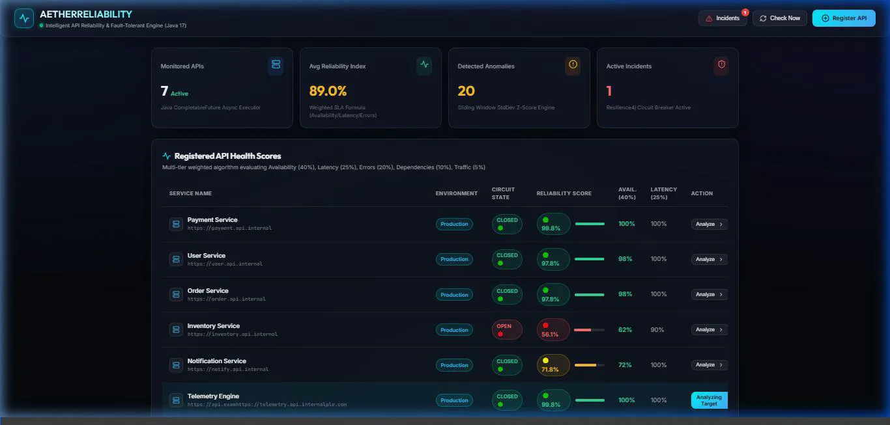

# Intelligent API Reliability Platform — Java 17 & React

An enterprise-grade, high-concurrency API monitoring, anomaly detection, failure prediction, root-cause tracing, and automated self-healing platform. Built with **Java 17 / Spring Boot 3** and an **ultra-modern dark glassmorphism React dashboard**.

---

## 🎬 Live Platform Demo



> **Platform Walkthrough & Live Telemetry:**
> Watch the Intelligent API Reliability Platform operating in real time. The demo highlights concurrent multi-threaded API health pings, live Z-score anomaly detection, automated root-cause graph traversal, failure degradation probability forecasting, Resilience4j circuit breaker state transitions with self-healing auto-recovery, API contract schema drift detection, and multi-region synthetic edge monitoring.

---

## 🌟 Key Highlights & Core Capabilities

### 1. Concurrent API Monitoring Engine (`CompletableFuture`)
- Non-blocking multi-threaded asynchronous checks for registered APIs using custom `ThreadPoolTaskExecutor` and Java `CompletableFuture`.
- Scheduled batch pings and on-demand trigger checks with response time telemetry.

### 2. Multi-Tier SLA Health Score Algorithm
Calculates a 5-tier weighted reliability score ($0.0 - 100.0\%$):
$$\text{Reliability Score} = 0.40 \cdot \text{Avail} + 0.25 \cdot \text{Latency} + 0.20 \cdot \text{ErrorScore} + 0.10 \cdot \text{DepHealth} + 0.05 \cdot \text{Traffic}$$
- **🟢 HEALTHY**: Score $\ge 90\%$
- **🟡 DEGRADED**: Score $70\% - 89\%$
- **🔴 CRITICAL**: Score $< 70\%$

### 3. Intelligent Anomaly Detection Engine (Moving Average & Z-Score)
- Computes sliding window **Moving Average** ($\mu$) and **Standard Deviation** ($\sigma$).
- Calculates Z-Score:
$$Z = \frac{X - \mu}{\sigma}$$
- Flags statistical anomalies when $Z > 2.0\sigma$ or latency exceeds baseline bounds.

### 4. Failure Prediction & Degradation Forecasting
- Tracks multi-sample score degradation velocity curves ($98\% \rightarrow 95\% \rightarrow 91\% \rightarrow 84\% \rightarrow 72\%$).
- Generates high-probability failure alerts and isolates contributing root factors before SLA breach occurs.

### 5. Dependency Intelligence & Root Cause Analysis
- Models microservice topology (`Order Service` $\rightarrow$ `Inventory Service` $\rightarrow$ `PostgreSQL Database`).
- Graph traversal isolates downstream component failures and calculates verdict confidence.

### 6. Resilience4j Circuit Breaker & Automated Self-Healing
- Implements 3-state fault tolerance (`CLOSED` 🟢 $\rightarrow$ `OPEN` 🔴 $\rightarrow$ `HALF_OPEN` 🟡).
- Executes self-healing probe tests and automated recovery workflows.

### 7. API Contract Drift Detector
- Compares expected API schema against live JSON response payloads.
- Highlights breaking field removals (`name` $\rightarrow$ `productName`), added fields, and type mismatches.

### 8. Global Multi-Region Synthetic Monitoring
- Regional edge node latency probes across **India (ap-south-1)**, **Singapore (ap-southeast-1)**, **Europe (eu-central-1)**, and **US (us-east-1)**.

---

## 🏗️ Project Architecture

```
api-reliability-platform/
├── backend/
│   ├── pom.xml
│   └── src/main/java/com/reliability/platform/
│       ├── model/          # ApiService, ApiMetrics, ApiDependency, AnomalyRecord, IncidentRecord, ContractSchema
│       ├── repository/     # JPA Data Repositories for H2 / PostgreSQL
│       ├── dto/            # HealthScoreResult, FailurePredictionDto, RootCauseAnalysisDto, SyntheticCheckResult
│       ├── service/        # MonitoringEngine, HealthScore, AnomalyDetection, FailurePrediction, ResilienceManager
│       └── controller/     # ApiController, MonitoringController, AnomalyController, PredictionController, ResilienceController
└── frontend/
    ├── package.json
    ├── vite.config.js
    └── src/
        ├── components/     # Navbar, KpiOverview, HealthScoreTable, AnomalyDetector, DependencyGraph, FailurePrediction, CircuitBreakerConsole, ContractDriftViewer, SyntheticMapGrid
        ├── services/       # apiService.js (REST Client with client fallback demo state)
        └── index.css       # Glassmorphism design system
```

---

## 🚀 Quick Start & Launch Instructions

### Backend (Spring Boot 3 / Java 17)
```bash
cd backend
mvn spring-boot:run
```
*Runs REST API Gateway on `http://localhost:8080` (H2 Database console enabled at `http://localhost:8080/h2-console`)*

### Frontend (React + Vite)
```bash
cd frontend
npm install
npm run dev
```
*Launches dashboard at `http://localhost:5173`*
